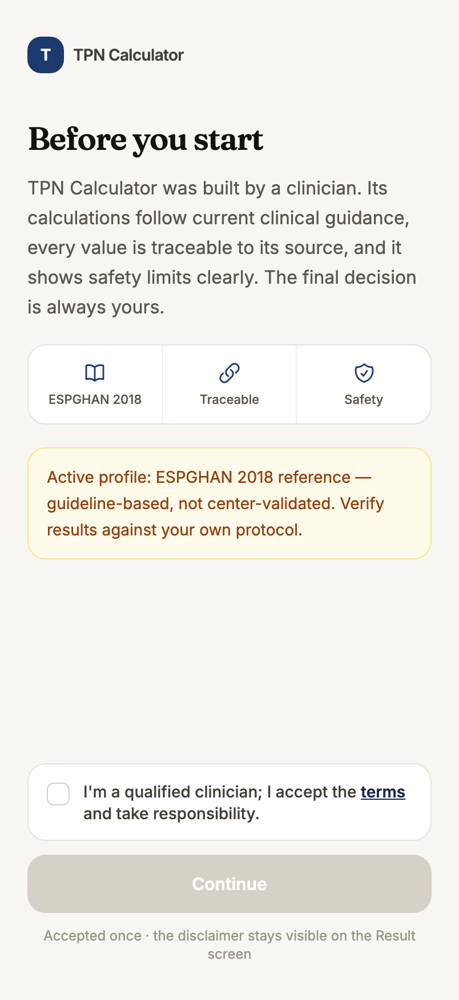
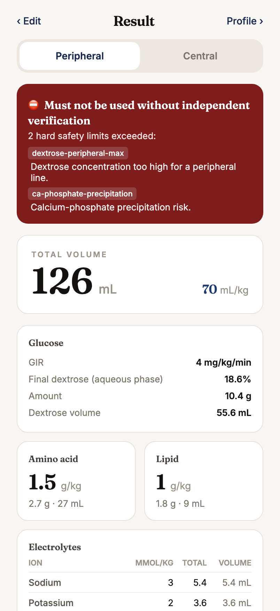
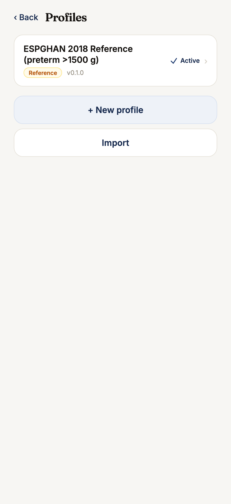

<h1 align="center">TPN Calculator</h1>

<p align="center">
  <strong>Configurable parenteral nutrition calculator for neonatal &amp; pediatric patients.</strong><br>
  Every clinical value lives in a center profile — nothing is hardcoded.
</p>

<p align="center">
  <a href="https://github.com/sahinparlak/tpn-calculator/actions/workflows/ci.yml"></a>
  
  <a href="#license"></a>
  
</p>

<p align="center">
  <strong>▶ <a href="https://sahinparlak.github.io/tpn-calculator/">Try it live</a></strong>
</p>

> ⚠️ **Clinical decision-support tool — not a medical device.** The prescribing
> clinician is fully responsible for every prescription. See
> [`DISCLAIMER.md`](./DISCLAIMER.md).

---

## Screenshots

<p align="center">
  
  &nbsp;
  
  &nbsp;
  
</p>
<p align="center"><sub>Disclaimer gate · result with hard safety warnings · profile management (Phase 3)</sub></p>

## Why

Total parenteral nutrition (TPN) for neonates and children is calculation-heavy,
error-prone, and **different at every center** — different dose schedules, limits,
product concentrations, and units. Most calculators bake one institution's
protocol into the code.

I'm a pediatric surgery resident, and TPN is part of my daily clinical routine —
exactly the kind of repetitive, high-stakes calculation that deserves better,
safer tooling. This project grew out of that need.

So it flips the usual approach: instead of hardcoding one hospital's protocol, it
pairs a **pure, tested calculation engine** with a **per-center configuration
profile**. The same engine powers every center; only the profile changes — and
it's **free under MIT**, so any unit can adapt it to their own protocol.

## Architecture

```
tpn-calculator/                 (monorepo · npm workspaces)
├── packages/
│   └── engine/        @tpn/engine — framework-agnostic calc core, fully tested
├── apps/
│   ├── mobile/        Expo (React Native) · iOS + Android   ← built first
│   └── web/           React + Vite · in-browser web app       ← Phase 4
├── profiles/          center profiles + JSON Schema
└── docs/              plan, profile-authoring guide
```

The engine knows **no clinical constants**. It takes a patient input and a
center profile, and returns a prescription plus safety warnings.

## Configuration-first

A center profile defines fluid schedules, energy targets, glucose/GIR limits,
amino-acid & lipid dosing, electrolytes, additives, and safety rules (hard =
block, soft = warn). Units (kcal/kJ, mmol/mEq) are configurable for
international use.

See [`docs/PROFILE.md`](./docs/PROFILE.md) and the
[JSON Schema](./profiles/schema/profile.schema.json). A blank starter profile:
[`profiles/erciyes-nicu.template.json`](./profiles/erciyes-nicu.template.json).

## Roadmap

- [x] **Phase 0** — Design lock: domain model, profile schema, plan
- [x] **Phase 1** — `@tpn/engine`: calculation core + test suite
- [x] **Phase 2** — Mobile MVP (Expo): patient → result flow, embedded ESPGHAN profile, warnings, a11y + tests
- [x] **Phase 3** — Profile management UI + units: profile selection, full editor with live validation, JSON import/export
- [x] **Phase 4** — Web app: React + Vite build of the same engine — full calculator + profile management, deployed to GitHub Pages
- [ ] **Phase 5** — i18n, docs site, community

Full plan: [`docs/PLAN.md`](./docs/PLAN.md).

## License

[MIT](./LICENSE) © 2026 Sahin Parlak
